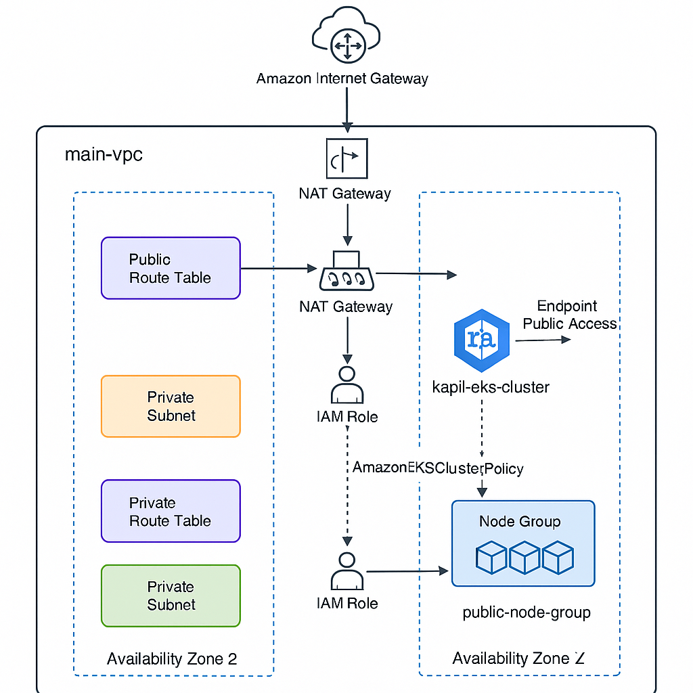

# 🚀 EKS Cluster Infrastructure with Terraform

This repository contains Terraform code to provision an **Amazon EKS (Elastic Kubernetes Service)** cluster along with its VPC, subnets, NAT Gateway, IAM roles, and a managed node group.

---

## 📐 Architecture



- **VPC** with public and private subnets  
- **Internet Gateway** and **NAT Gateway**  
- **Route tables** for public/private routing  
- **IAM roles and policies** for EKS and EC2 nodes  
- **Amazon EKS Cluster** with a managed **node group** in a public subnet  

---

## Architecture Components

| Component            | Description                                             |
|----------------------|---------------------------------------------------------|
| VPC                  | Custom Virtual Private Cloud with CIDR and DNS enabled  |
| Internet Gateway     | Allows public internet access to public subnet          |
| Public Subnet        | Subnet with public IP mapping for EKS node group        |
| Private Subnet       | Subnet for private resources, routed through NAT Gateway|
| NAT Gateway          | Enables private subnet instances to access internet     |
| Route Tables         | Public and private route tables to manage traffic flow  |
| IAM Roles            | Roles for EKS control plane and worker node permissions |
| EKS Cluster          | Managed Kubernetes control plane                         |
| EKS Node Group       | EC2 instances running Kubernetes worker nodes           |

---

## 📦 Folder Structure

```
.
├── main.tf                # Terraform resources
├── variables.tf           # Input variables
├── terraform.tfvars       # Variable values (user-specific)
├── output.tf              # Outputs
├── README.md              # This file
├── terraform.tfstate*     # Terraform state files
└── VPC.png                # Architecture diagram
```

---

🚧 Future Plans

    1. Modularize Terraform code for reusability and scalability

    2. Add Terraform Cloud backend support for state management

    3. Integrate CI/CD pipelines using GitHub Actions or Jenkins

    4. Implement Argo CD for GitOps-based Kubernetes app deployment

    5. Add support for private EKS endpoints and security groups

    6. Add EKS Fargate profiles for serverless pods

    7. Implement monitoring and logging with Prometheus, Grafana, and ELK stack

    8. Automate IAM role policies and node group autoscaling

    9. Create comprehensive unit and integration tests using Terraform testing frameworks

---

## ⚙️ Prerequisites

- AWS CLI installed and configured  
- Terraform >= 1.3  
- AWS IAM user with EKS and VPC permissions  
- kubectl installed  

---

## 🔧 How to Use

### 1. Clone the Repository

```bash
git clone https://github.com/your-username/eks-cluster-terraform.git
cd eks-cluster-terraform
```

### 2. Initialize Terraform

```bash
terraform init
```

### 3. Update Variables

Modify the `terraform.tfvars` file with your desired values:

```hcl
aws_region           = "us-east-1"
vpc_cidr             = "10.0.0.0/16"
public_subnet_cidr   = "10.0.1.0/24"
private_subnet_cidr  = "10.0.2.0/24"
availability_zone    = ["us-east-1a", "us-east-1b"]
```

### 4. Apply the Infrastructure

```bash
terraform apply
```

> Review the changes and type `yes` to confirm.

### 5. Configure `kubectl`

```bash
aws eks --region <your-region> update-kubeconfig --name kapil-eks-cluster
kubectl get nodes
```

---

## ✅ Outputs

After successful deployment, Terraform will output:

- EKS Cluster Name  
- VPC ID  
- Subnet IDs  

---

## 🧹 Clean Up

To destroy all resources:

```bash
terraform destroy
```

---

## 🧠 Author

**Kapil Gole**  
DevOps Enthusiast | Cloud Learner

---

## 📄 License

This project is licensed under the MIT License.
